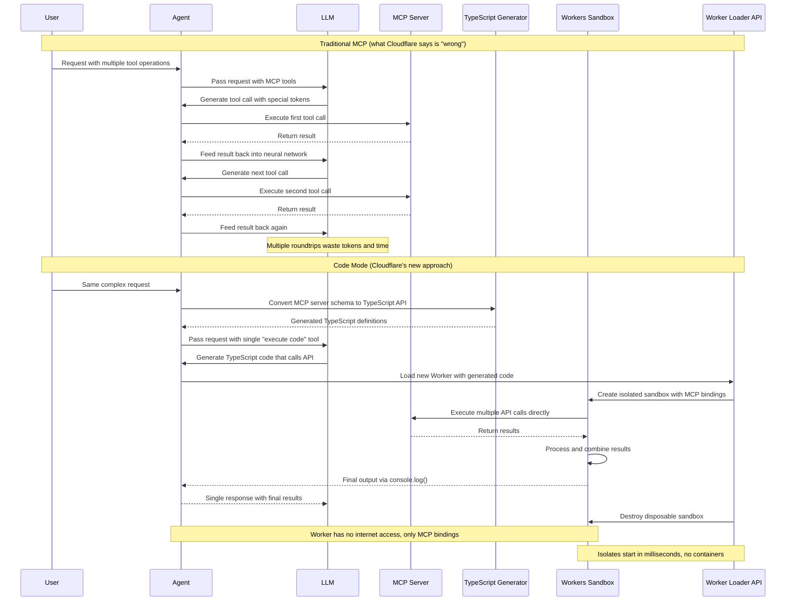

https://blog.cloudflare.com/code-mode/

Cloudflare’s blog post “Code Mode: the better way to use MCP,” authored by Kenton Varda and Sunil Pai, introduces a new approach to using the Model Context Protocol (MCP) that significantly improves AI agent performance. Traditional MCP usage involves directly exposing tools to large language models (LLMs), but this method faces limitations due to LLMs’ limited familiarity with tool-call tokens, resulting in difficulty with complex or numerous tools.

The new **Code Mode** approach converts MCP tools into a **TypeScript API** and instructs the LLM to write code that calls the API. This provides several advantages:

1. **Improved Tool Handling:** LLMs handle more tools and complex interactions better because they are extensively trained on real-world TypeScript code rather than synthetic tool-calling data.
2. **Efficient Multi-Call Execution:** Code Mode allows LLMs to chain multiple tool calls without looping every result back through the neural network, reducing token use and improving speed.

**How MCP and Code Mode Work:**
- MCP is a protocol that gives AI agents uniform access to external tools via a standard RPC-like interface with built-in documentation and out-of-band authorization.
- In Code Mode, the MCP server’s schema is automatically **converted into a TypeScript API** with full documentation. The LLM writes and executes TypeScript code that interacts with these APIs.
- The code runs in a **secure, sandboxed environment** using Cloudflare Workers’ lightweight **V8 isolates**, which provide faster, cheaper, and disposable sandboxes than traditional containers.

**Dynamic Worker Loader API:**
- Enables loading and executing arbitrary Worker code on-demand without global deployment.
- Sandboxes are isolated from the internet but can access MCP servers via **bindings**, preventing API key leaks and ensuring clean authorization.
- Isolates are fast to start, memory-efficient, and disposable, making them ideal for running agent-generated code securely and at low cost.

**Security and Efficiency Benefits:**
- Sandboxed code cannot access the open internet.
- Access to MCP tools is strictly controlled through bindings.
- No API keys are exposed to the AI, mitigating common security risks in AI-generated code.

**Getting Started:**
- Developers can experiment locally with **Wrangler** and **workerd** using the new Dynamic Worker Loading and Code Mode in the Agents SDK.
- A production beta for the Worker Loader API is available for sign-up.

Cloudflare positions this innovation as a major step toward making AI agents more capable, efficient, and secure, leveraging its global Workers platform and commitment to building a better Internet.

