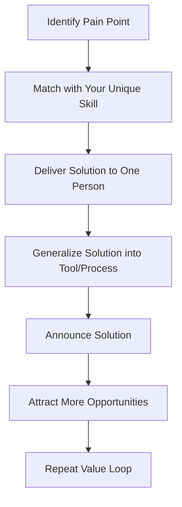

https://alifeengineered.substack.com/p/nobody-cares-how-hard-you-work

This article by Steve Huynh explores why effort alone is often invisible in the professional world and emphasizes the importance of creating real value by aligning one’s unique skills with actual pain points—what he calls achieving “product-market fit” for your career.

Huynh begins with the story of a highly talented and hardworking polymath who had created 5,000 YouTube videos over 8 years but had only a few hundred subscribers. Despite massive effort and skill, his work lacked impact because it didn’t address a market need. This illustrates the central truth: success comes not from hard work alone but from creating value that others recognize.

### Key Concepts

1. **Your Market Is a Pain Point**  
   - Success starts with identifying real, costly problems, not just generating ideas.  
   - Companies hire to solve pain, not because you have skills.  
   - Apply “The Mom Test” to your boss: uncover their most frustrating problems to find your market.

2. **Your Skills Are the Product**  
   - Treat your skills as the product you are selling to your market.  
   - Focus on developing skills that repeatedly solve high-value problems.  
   - Your most powerful skills are often “effortless” to you and align with your personality.

3. **Make Your Hard Work Matter**  
   - Effort is invisible until it’s connected to value.  
   - Once you find product-market fit for your skills, your work gains leverage.  
   - Create a “Value Loop”:  
     1. Solve one person’s pain.  
     2. Generalize the solution into a tool or process.  
     3. Announce and share the solution to attract more opportunities.

### Conclusion
Outlier success is less about working harder and more about aligning effort with needs that truly matter. Recognize your unique “product,” find a market where it has impact, and then amplify your value through repeatable loops.

---

### Mermaid Diagram – Career Product-Market Fit

This diagram illustrates the feedback loop of identifying pain, applying your authentic skills to solve it, and turning solutions into repeatable value.