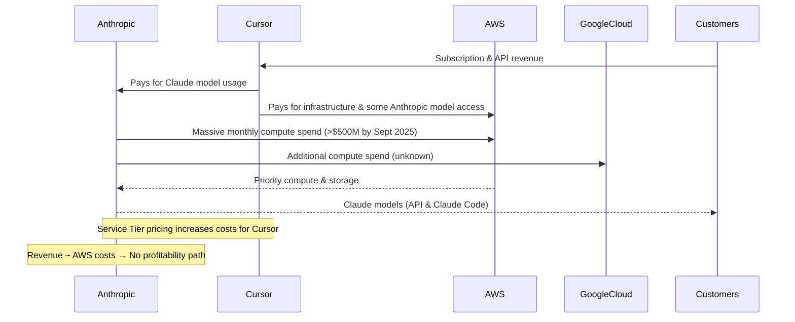

**This Is How Much Anthropic and Cursor Spend On Amazon Web Services**  
https://www.wheresyouredat.com/p/this-is-how-much-anthropic-and-cursor-spend-on-aws

Edward Zitron’s article provides an in-depth analysis of the massive costs Anthropic and its largest client, Cursor, incur running generative AI models on Amazon Web Services (AWS). Key takeaways include:

- **Anthropic’s AWS Spending**  
  - 2024: $1.35 billion on AWS against an estimated $400–600 million in revenue (over 200% of revenue spent).  
  - 2025 (Jan–Sept): $2.66 billion spent on AWS on $2.55 billion estimated revenue (~104% of revenue spent).  
  - AWS costs increase almost linearly with revenue, suggesting no path to profitability under current pricing.  
  - Likely significant additional spending on Google Cloud, potentially equal to AWS spend.

- **Cursor’s AWS Spending**  
  - Jan–Sept 2025: $69.99 million.  
  - AWS bills exploded in June 2025 (from $6.19M to $12.67M) after Anthropic introduced **Priority Service Tiers**, which increased costs for cache-heavy AI coding workloads.  
  - Cursor’s costs reflect the broader “Subprime AI Crisis,” where model providers raise prices on dependent startups while competing with them (e.g., Claude Code).

- **The Subprime AI Crisis**  
  - Anthropic’s rent-seeking via Service Tiers shifted financial pressure onto startups like Cursor.  
  - Anthropic simultaneously launched Claude Code, directly competing with Cursor.  
  - Both Anthropic and OpenAI risk collapsing the market by driving up costs for any company building on their models.

- **Overall Implications**  
  - Scaling generative AI is currently unprofitable; as revenue grows, compute costs rise faster.  
  - Both Anthropic and Cursor face unsustainable burn rates.  
  - Without major price increases—or breakthroughs in cost efficiency—AI-native companies risk financial collapse.

---

### Mermaid Sequence Diagram

This illustrates the cycle of revenue and cost escalation, with AWS and likely Google Cloud absorbing nearly all operational revenue, while startup customers like Cursor suffer under increasing compute expenses.