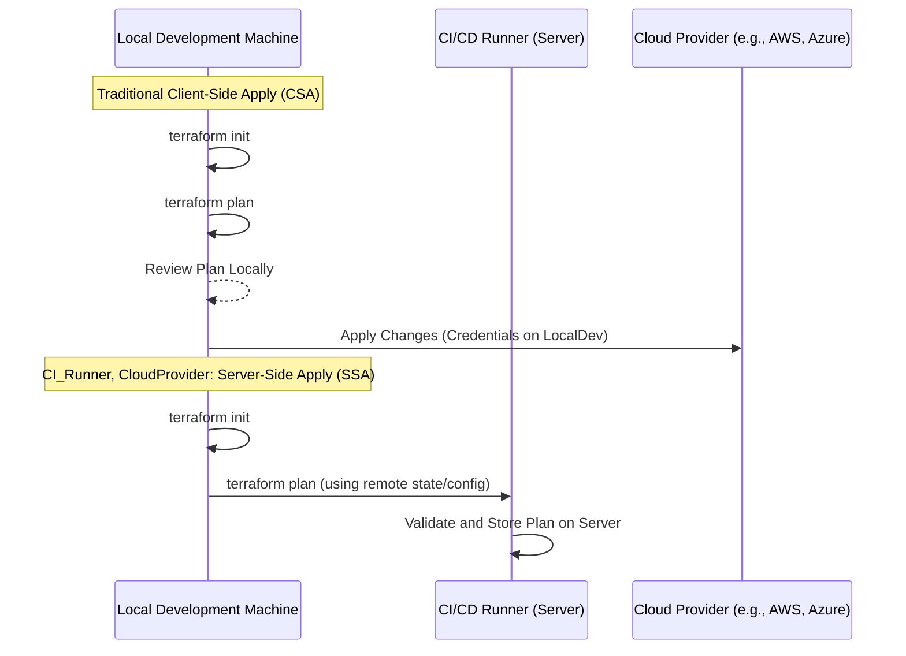

https://andreaskaris.github.io/blog/coding/server-side-apply/

The provided article discusses the concept of "Server-Side Apply" (SSA) in the context of

infrastructure as code (IaC), specifically focusing on its implementation and benefits within

Terraform. SSA is presented as a powerful advancement over traditional client-side apply

workflows.

**Key Concepts and Benefits:**

* **Client-Side Apply (CSA):** The default Terraform workflow where the `terraform apply`

command is executed on the user's local machine. This involves the local machine performing the

plan, validating it, and then sending the apply commands to the cloud provider.

* **Server-Side Apply (SSA):** A paradigm shift where the `terraform apply` execution is moved to

a remote server (e.g., a CI/CD runner, a dedicated Terraform Cloud/Enterprise instance). The local

machine's role is reduced to generating and validating the plan. The actual apply operation then

occurs on the server.

* **Improved Security:** SSA enhances security by keeping sensitive cloud provider credentials on

the remote server, rather than on potentially less secure local development machines. This reduces

the attack surface for compromised credentials.

* **Enhanced Reliability and Consistency:** SSA ensures that applies are executed in a consistent

environment, free from local machine issues like network interruptions, differing tool versions, or

resource constraints. This leads to more predictable and reliable deployments.

* **Scalability:** SSA allows for the concurrent execution of Terraform applies across multiple

projects or environments, as the compute resources are managed server-side.

* **Auditability and Governance:** SSA workflows, particularly when integrated with platforms like

Terraform Cloud, provide better audit trails of who applied what changes and when, improving

governance and compliance.

* **Decoupling of Plan and Apply:** SSA separates the process of planning (which can be done

locally or in CI) from the actual application of changes. This allows developers to review and

approve plans before they are executed in a production environment.

* **Use Cases:** SSA is particularly beneficial for:

* Production environments where security and reliability are paramount.

* CI/CD pipelines for automated and consistent deployments.

* Organizations with strict security and governance requirements.

The article emphasizes that while CSA is suitable for local development and testing, SSA is the

recommended approach for production deployments and automated workflows. It highlights that

modern IaC platforms and CI/CD tools are increasingly supporting and promoting SSA.

