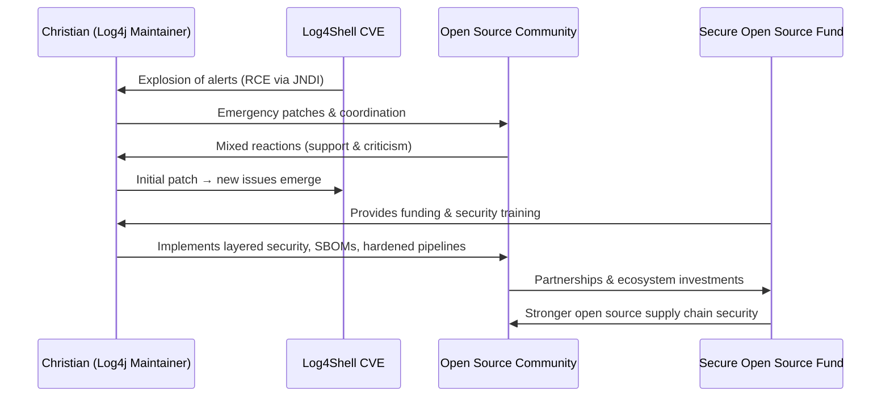

**Inside the breach that broke the internet: The untold story of Log4Shell**  
https://github.blog/2025-10-20-inside-the-breach-that-broke-the-internet-log4shell

---

The article recounts the **Log4Shell crisis**, a catastrophic vulnerability in the Log4j Java library that shook the internet in 2021–2022.  

### Key Points:

- **Discovery and Impact**  
  - Log4Shell was triggered by a remote code execution flaw via Java’s JNDI feature, allowing attackers to execute malicious code simply by logging a crafted string.  
  - The flaw affected **billions of devices**, from Fortune 500 infrastructure to Minecraft servers, earning a **CVSS score of 10**.  
  - Log4j’s ubiquity in the Java ecosystem made it a “perfect storm” for widespread exploitation.

- **Human Toll and Open Source Vulnerability**  
  - Maintainer **Christian Grobmeier** and the Log4j team—mostly volunteers—handled the emergency under immense stress, patching the flaw while facing community criticism and overwhelming pressure.  
  - The incident revealed the fragile **human layer** of critical software infrastructure, where small teams maintain software that powers the world.

- **Lessons Learned**  
  - **Technical takeaways**:  
    1. Validate all external input.  
    2. Disable risky features (JNDI) by default.  
    3. Use layered security measures and automated scanning.  
    4. Maintain SBOMs (Software Bills of Materials) for dependency tracking.  
  - **Industry-wide realizations**:  
    - Open source maintainers need **training, funding, and community support**, not just code fixes.  
    - Ignorance is the most dangerous vulnerability in the software supply chain.

- **Response and Future Prevention**  
  - GitHub’s **Secure Open Source Fund** emerged to provide funding, proactive security training, and tools for maintainers.  
  - Christian’s participation in the program shifted mindset: developers can be the **first line of defense**, not the weakest link.  
  - The initiative encourages individuals, enterprises, and maintainers to share responsibility for securing the open source ecosystem.

- **Call to Action**  
  - Apply for the GitHub Secure Open Source Fund.  
  - Contribute code, security reviews, documentation, and funding to the projects your systems depend on.  
  - Keep learning and building security into projects by default.

---

### Mermaid Sequence Diagram

---

The Log4Shell incident stands as a stark reminder: **open source security is not just a code problem—it’s a human problem, requiring collective responsibility and proactive defense.**