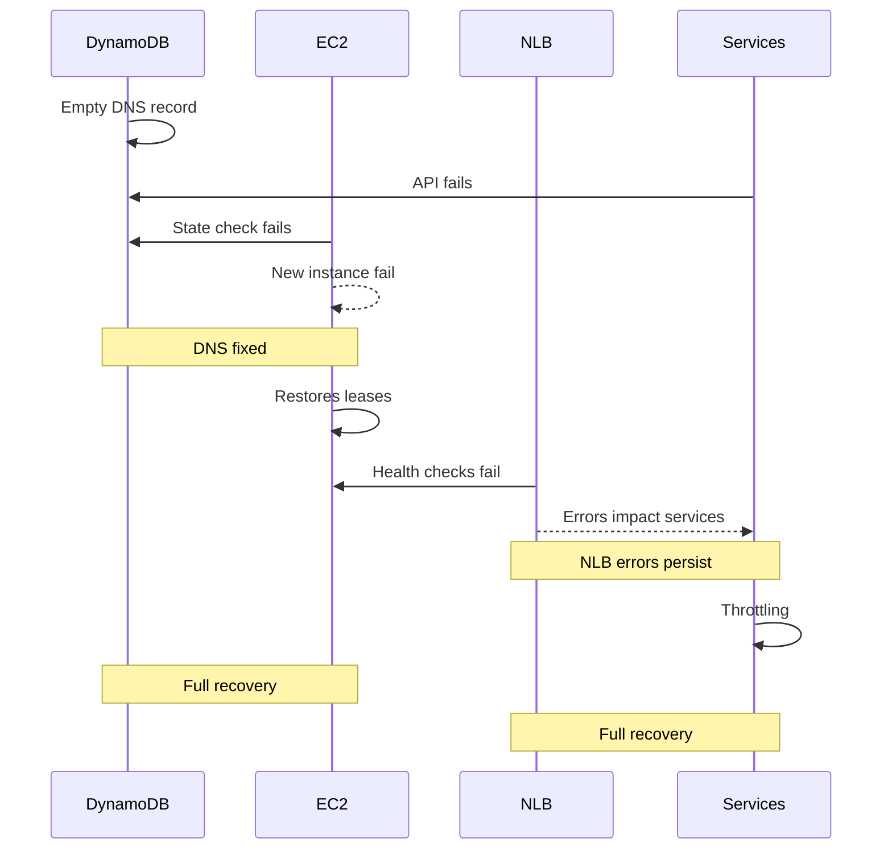

[https://aws.amazon.com/message/101925/](https://aws.amazon.com/message/101925/)

Amazon Web Services experienced a **major service disruption** in the Northern Virginia (us-east-1) Region from **October 19, 2025, 11:48 PM PDT to October 20, 2025, 2:20 PM PDT**. The outage impacted DynamoDB, EC2, Network Load Balancers (NLB), and multiple dependent AWS services.  

### Key Points

1. **Primary Cause**
   - A **latent race condition** in DynamoDB’s **DNS management system** caused an **empty DNS record** for the regional endpoint, preventing new connections.
   - Manual operator intervention was required because the system entered an **inconsistent state** that DNS automation could not resolve.

2. **Service Impact Timeline**
   - **DynamoDB (11:48 PM – 2:40 AM)**  
     - DNS resolution failures caused API errors and prevented new connections.  
     - Global table replication continued but with delays to/from us-east-1.  
     - Full recovery at 2:40 AM.
   - **EC2 (11:48 PM – 1:50 PM)**  
     - Instance launches failed due to **DWFM (DropletWorkflow Manager) lease expirations** caused by failed DynamoDB-dependent state checks.  
     - Network configuration propagation was delayed, leading to connectivity issues. Full recovery at 1:50 PM.
   - **Network Load Balancer (5:30 AM – 2:09 PM)**  
     - **Health check failures** occurred because new EC2 instances lacked network configuration.  
     - Triggered failovers, DNS removals, and connection errors. Stabilized after disabling auto failover.
   - **Other Services**  
     - **Lambda, ECS/EKS, Fargate, STS, Redshift, and Amazon Connect** experienced errors due to dependencies on DynamoDB, EC2 launches, and NLB health checks.  
     - Most services recovered by early afternoon, with Redshift cluster availability fully restored by **October 21, 4:05 AM PDT**.

3. **Remediation and Future Improvements**
   - DynamoDB DNS automation globally disabled until the race condition is fixed and safeguards are added.  
   - EC2 will implement **better throttling and DWFM recovery tests**.  
   - NLB will add **velocity controls** for AZ failover events.  
   - AWS is enhancing **scale testing** and **cross-service dependency resilience** to shorten recovery times.

---

### Mermaid Sequence Diagram of the Incident

This incident demonstrates the **cascading impact of interdependent cloud services** when a single DNS automation failure affects core APIs, compute instances, and network load balancers across multiple services.