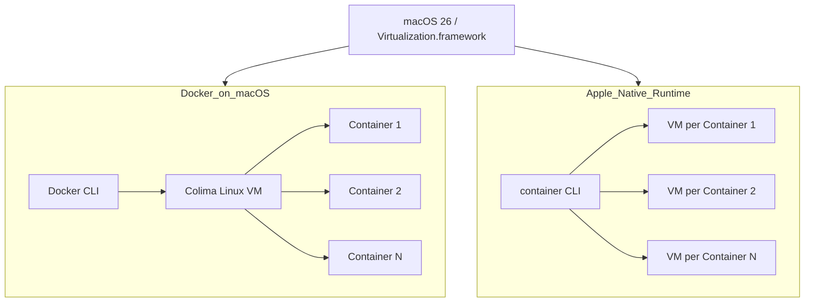

**Apple's native container v0.5.0 runtime**  
https://shipit.dev/posts/apples-native-container-runtime-v050.html  

Apple quietly introduced its **native container runtime** in macOS 26, aiming to blend the benefits of traditional containerization with the stronger isolation of virtual machines. Unlike Docker on macOS—which runs all containers inside a single Linux VM via Colima—Apple’s implementation assigns **each container its own virtual machine**, complete with:

- Independent ext4-based storage
- Unique IP addresses
- Configurable CPU and memory limits  

This architecture leverages macOS’s **Virtualization.framework** and memory balloon devices for dynamic memory management, resulting in **sub-second cold and warm starts** of containers. Apple’s runtime follows the **Open Containers Initiative (OCI)** standards, supports existing Docker/Podman/Kubernetes images, and even allows running amd64 images via **Rosetta 2** translation.

### Key Points:
1. **Performance**  
   - Cold start: ~1.2s  
   - Warm start: ~0.8s  
   - CPU and memory performance comparable to Docker  
   - Memory utilization lower with stopped containers  
   - I/O benchmarks showed mixed results:  
     - *stress-ng* favored Apple’s runtime  
     - *fio* favored Docker for certain workloads  

2. **Differences from Docker**  
   - No shared host VM → faster startup  
   - Stronger isolation (VM per container)  
   - Missing some Docker features like Buildx, Compose, and Kubernetes integration  

3. **Benchmark Takeaways**  
   - **CPU:** Nearly identical  
   - **Memory:** Apple runtime performs better  
   - **I/O:** Docker generally stronger  
   - Native runtime suitable for local dev tasks, but Docker still dominates for complex orchestration  

4. **Future Outlook**  
   - Apple’s container runtime is promising for development  
   - Versions ≥0.6.0 add features like subnet support  
   - Potential to become a lightweight, secure alternative as tooling matures  

---

### Mermaid Diagram of Apple’s Container Runtime vs Docker on macOS

This model highlights Apple’s **per-container VM** approach, which improves isolation and startup speed at the cost of some missing ecosystem features and inconsistent I/O performance.