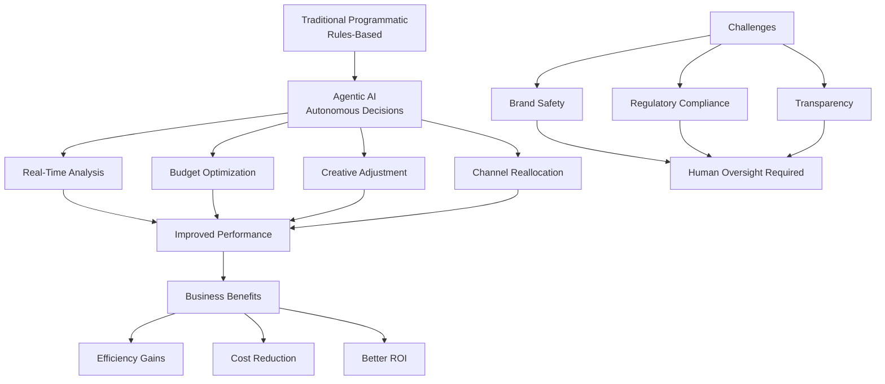

# Making the Case for Agentic AI Media Buying

https://www.adtechexplained.com/p/making-the-case-for-agentic-ai-media-buying

## Summary

Agentic AI represents a significant evolution in media buying, moving beyond traditional programmatic advertising to autonomous decision-making systems. The article explores how AI agents can independently manage advertising campaigns with minimal human intervention.

**Key Points:**

- **Current State**: Traditional programmatic advertising relies on rules and human oversight; agentic AI operates autonomously within defined parameters
- **Capabilities**: AI agents can analyze vast datasets in real-time, optimize bidding strategies, adjust creative elements, and reallocate budgets across channels automatically
- **Advantages**: Improved efficiency, faster response to market changes, better performance optimization, and reduced need for constant manual adjustments
- **Real-world Applications**: Media agencies are testing agentic AI for campaign management, audience targeting, and creative optimization
- **Challenges**: Transparency concerns, brand safety risks, regulatory compliance, and the need for proper guardrails
- **Future Direction**: Integration of agentic AI will require trust-building, clear accountability structures, and human oversight at strategic decision points

