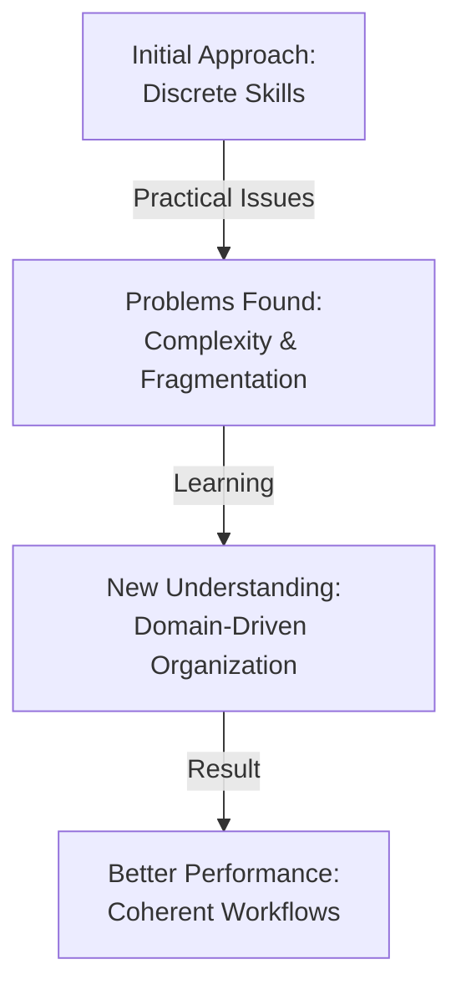

# I Was Wrong About Agent Skills and How I Refactor

[https://www.reddit.com/r/ClaudeAI/comments/1opxgq4/i_was_wrong_about_agent_skills_and_how_i_refactor/](https://www.reddit.com/r/ClaudeAI/comments/1opxgq4/i_was_wrong_about_agent_skills_and_how_i_refactor/)

## Summary

The post discusses a developer's reconsideration of their approach to organizing agent capabilities and skills in Claude-based systems. The author initially believed in structuring agent functionality around discrete "skills" as separate modules, but through practical experience, they discovered limitations and inefficiencies in this architecture.

**Key Points:**

- **Original Approach**: The author organized agent capabilities as isolated skill modules, assuming this would improve maintainability and reusability
- **Discovered Problems**: This structure led to increased complexity, redundant code, and made it harder for Claude to reason about interconnected tasks
- **Core Issue**: Breaking functionality into too granular "skills" created artificial boundaries that didn't reflect how tasks actually interconnect in real-world scenarios
- **New Understanding**: Agent capabilities work better when organized around workflows and domains rather than micro-level skills
- **Better Practice**: Grouping related capabilities together and allowing Claude to understand the full context of interconnected operations leads to better reasoning and performance
- **Refactoring Strategy**: The author now focuses on organizing code by business domain and workflow patterns rather than trying to create perfectly isolated, reusable skills

**Practical Takeaway**: When building Claude-based agents, prioritize coherent task domains and workflow organization over creating maximally reusable, isolated skill components.

