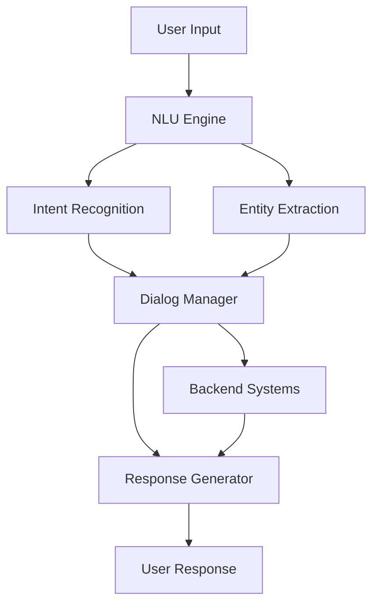

# How Uber Built a Conversational AI

[How Uber Built a Conversational AI](https://blog.bytebytego.com/p/how-uber-built-a-conversational-ai?utm_source=post-email-title&publication_id=817132&post_id=178284229&utm_campaign=email-post-title&isFreemail=true&r=5d6mv&triedRedirect=true&utm_medium=email)

## Summary

Uber has developed a sophisticated conversational AI system to enhance customer support and user experience across its platforms. The architecture combines multiple components to handle natural language understanding and generation at scale.

**Key Components:**

- **Intent Recognition**: Uses machine learning models to identify what users are trying to accomplish from their messages
- **Entity Extraction**: Identifies relevant data points like locations, times, ride types, and payment methods
- **Dialog Management**: Maintains conversation context and determines appropriate system responses
- **Response Generation**: Creates contextually relevant, natural-sounding replies to user queries
- **Multi-Channel Integration**: Works across text, voice, and app-based interfaces

**Technical Approach:**

The system employs transformer-based neural networks and large language models fine-tuned specifically for Uber's domain. It handles ambiguity, context switching, and complex multi-turn conversations. The AI integrates with Uber's backend systems to access real-time data about rides, orders, accounts, and support tickets.

**Scalability Considerations:**

- Handles millions of concurrent conversations
- Low-latency response requirements for real-time interactions
- Language support across multiple markets
- Continuous learning and improvement through user interactions

