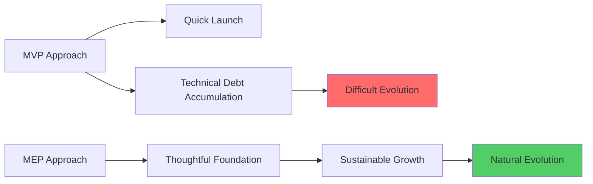

# Minimum Evolvable Product

[https://ankitg.me/blog/2025/11/10/minimum-evolvable-product.html](https://ankitg.me/blog/2025/11/10/minimum-evolvable-product.html)

## Summary

The article introduces the concept of a "Minimum Evolvable Product" (MEP) as an evolution beyond the traditional Minimum Viable Product (MVP) approach. Rather than building the smallest feature set that satisfies initial customer needs, MEP focuses on creating a foundation that can naturally and sustainably grow based on user feedback and market demands.

**Key Distinctions:**
- **MVP** prioritizes speed to market with bare-minimum functionality, often resulting in technical debt and limited scalability
- **MEP** emphasizes building with future evolution in mind, ensuring the product architecture and design can accommodate growth without major overhauls

**Core Principles of MEP:**
- Intentional architecture that supports incremental feature additions
- Clean code practices and documentation for maintainability
- Stakeholder communication about long-term product vision
- Flexibility in choosing technology and design patterns
- Building feedback mechanisms for continuous improvement

**Benefits:**
- Reduced need for future rewrites or major refactoring
- Faster iteration cycles as the product matures
- Better team morale through sustainable development practices
- Lower total cost of ownership over the product lifecycle

The article advocates for MEP as a balanced approach between agile speed and engineering sustainability, particularly valuable for products expected to have longer lifecycles and need continuous adaptation.