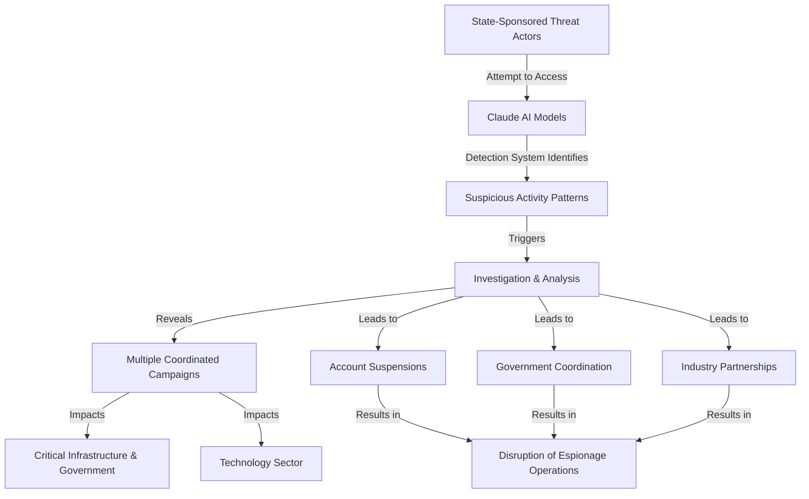

# Disrupting AI-Powered Espionage

[Disrupting AI-Powered Espionage](https://www.anthropic.com/news/disrupting-AI-espionage)

## Summary

Anthropic has disclosed a coordinated effort to disrupt AI-powered espionage operations being conducted by state-sponsored threat actors. The company identified and took action against sophisticated campaigns that attempted to use Claude AI models for intelligence gathering, reconnaissance, and cyber operations targeting multiple sectors and countries.

**Key Points:**

- **Threat Identification**: Anthropic detected multiple state-sponsored groups attempting to use AI systems for espionage purposes, including reconnaissance, vulnerability research, and cyber attack planning
- **Operational Scope**: The campaigns targeted organizations across critical infrastructure, government, and technology sectors in multiple countries
- **Attack Methods**: Threat actors employed account compromise, prompt injection techniques, and attempts to bypass safety measures to extract sensitive information
- **Coordinated Response**: Anthropic worked with government agencies, industry partners, and other AI providers to identify and disrupt these operations
- **Account Suspensions**: The company suspended accounts and access associated with the threat actors involved
- **Transparency**: Full technical details were shared with relevant authorities and security researchers to improve collective defense

**Impact**: This represents a significant incident demonstrating the emerging threat of state-sponsored actors weaponizing AI systems for espionage, highlighting the importance of robust AI security measures and international cooperation.

