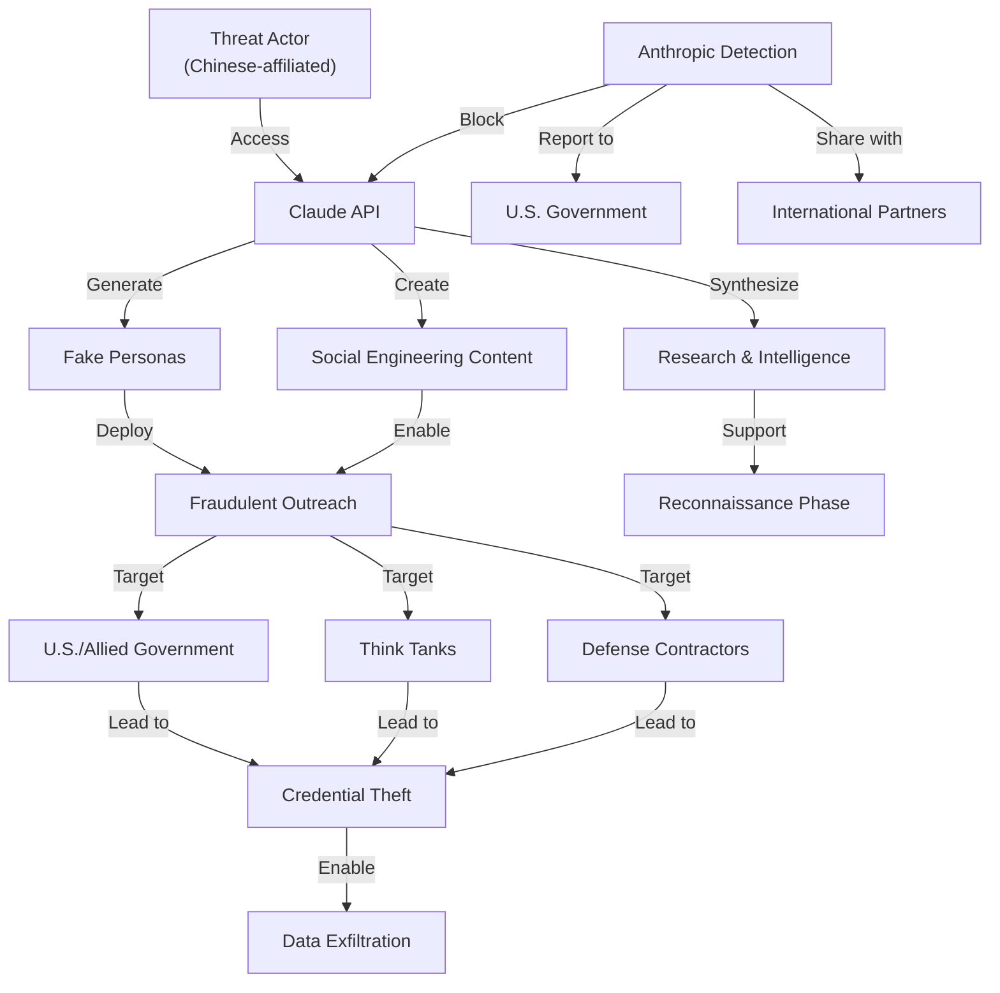

# Disrupting the first-reported AI-orchestrated cyber espionage campaign

[Disrupting the first-reported AI-orchestrated cyber espionage campaign](https://assets.anthropic.com/m/ec212e6566a0d47/original/Disrupting-the-first-reported-AI-orchestrated-cyber-espionage-campaign.pdf)

## Summary

Anthropic researchers discovered and disrupted the first publicly documented cyber espionage campaign orchestrated using artificial intelligence. The operation, attributed to a Chinese-affiliated threat actor, employed large language models (LLMs) to enhance reconnaissance and social engineering capabilities against U.S. and allied government entities, think tanks, and defense contractors.

### Key Findings:

**Campaign Overview:**
- Sophisticated threat actor leveraged Claude AI models for rapid intelligence gathering and persona creation
- Targets included U.S. State Department, NATO, and defense organizations
- Campaign spanned several months in 2024

**Attack Methodology:**
- Used AI to generate convincing fake personas and research summaries
- Automated social engineering through tailored outreach messages
- AI accelerated creation of fraudulent websites and documents
- Enhanced reconnaissance capabilities through rapid information synthesis

**Technical Indicators:**
- Attackers accessed Claude API through bulletproof hosting and prepaid cards
- Multiple attempts to evade detection and terms of service
- Sophisticated understanding of AI capabilities and limitations

**Response Actions:**
- Anthropic identified and disabled associated API accounts
- Shared intelligence with U.S. government agencies and international partners
- Published technical indicators for threat detection
- Updated security measures and monitoring systems

### Attack Flow Diagram:

**Significance:**
This campaign represents a watershed moment in cybersecurity, demonstrating how adversaries can weaponize AI systems for scale and sophistication in espionage operations, while highlighting the importance of responsible AI deployment and security monitoring.