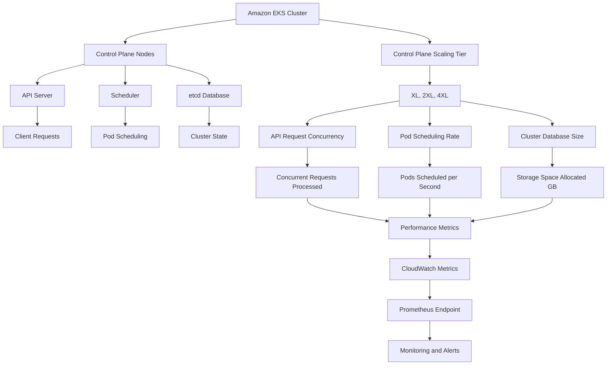

## Amazon EKS Provisioned Control Plane

This diagram illustrates the architecture of Amazon EKS Provisioned Control Plane, highlighting its components and interactions:

### Overview

Amazon EKS Provisioned Control Plane allows cluster administrators to pre-allocate control plane capacity, ensuring high and predictable performance. It operates alongside the default Standard mode, which dynamically scales based on workload demands.

### Key Features

- **Scaling Tiers**: 
  - Available in XL, 2XL, and 4XL sizes.
  - Defined by API request concurrency, pod scheduling rate, and cluster database size.

- **Use Cases**:
  - Performance-critical workloads requiring minimal latency.
  - Massively scalable workloads like AI training and high-performance computing.
  - Anticipated high-demand events.
  - Environment consistency across staging, production, and disaster recovery.

### Control Plane Modes

- **Standard Mode**:
  - Automatically scales based on workload.
  - Recommended for most applications due to cost efficiency.

- **Provisioned Mode**:
  - Pre-allocated capacity for consistent performance.
  - Suitable for workloads intolerant of scaling variability.

### Monitoring and Management

- **Utilization Metrics**:
  - Available via Amazon CloudWatch and Prometheus.
  - Key metrics include API request concurrency, pod scheduling rate, and database size.

- **Tier Management**:
  - Requires explicit opt-in.
  - No automatic scaling between tiers; manual adjustments can be made.

### Considerations

- **Cost**: 
  - Additional hourly charges for Provisioned mode.
  - Pricing varies by tier and region.

- **Database Limitations**:
  - Standard mode supports up to 8 GB of etcd storage.
  - Transition back to Standard mode requires reducing database size below this threshold.

- **Performance Optimization**:
  - Adherence to Kubernetes best practices is essential for achieving expected performance levels.

This architecture and summary provide a comprehensive understanding of Amazon EKS Provisioned Control Plane, its benefits, and considerations for implementation.