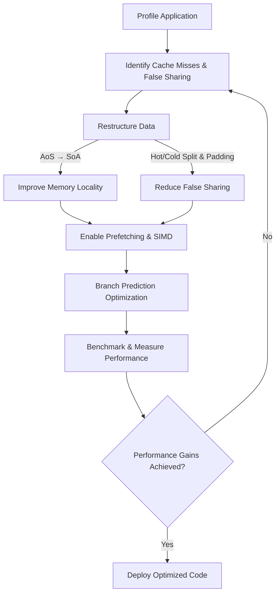

CPU Cache-Friendly Data Structures in Go: 10x Speed with Same Algorithm  
https://skoredin.pro/blog/cpu-cache-friendly-data-structures-go  

This article by Serge Skoredin explores how to optimize Go data structures for modern CPU cache hierarchies to significantly improve performance without changing core algorithms. It emphasizes the impact of cache misses, false sharing, and poor data layouts on real-world applications, showing how data-oriented design can achieve 5–15x speedups.

**Key Points:**
- **CPU Cache Hierarchy:** L1 (~1ns), L2 (~3ns), L3 (~10ns), and RAM (~60ns). A RAM access is ~60x slower than an L1 hit.
- **False Sharing:** Occurs when separate goroutines update variables that occupy the same 64-byte cache line. Padding with unused bytes can yield 5–10x improvements.
- **Data-Oriented Design:** Struct of Arrays (SoA) outperforms Array of Structs (AoS) by keeping hot data contiguous, improving prefetching efficiency.
- **Prefetching & Branch Prediction:**  
  - Linear access allows hardware prefetching; random access causes cache misses.  
  - Sorting data to create predictable branches or using branchless logic improves throughput.
- **Hot/Cold Data Splitting:** Separating frequently accessed (“hot”) fields from rarely accessed (“cold”) fields reduces cache thrashing.
- **NUMA Awareness:** Pinning goroutines to CPUs and organizing memory per NUMA node improves locality for high-concurrency workloads.
- **SIMD-Friendly Layouts:** Aligning data to 16 or 64 bytes enables vectorized processing and cache-efficient loops.
- **Cache-Conscious Hash Tables:** Robin Hood hashing with linear probing minimizes random access and improves cache utilization.
- **Benchmarking:** Use `perf`, Go benchmarks, and realistic data loads to measure improvements; micro-optimizations are workload and hardware dependent.
- **Real-World Gains:**  
  - Analytics pipeline: 14.5x faster  
  - Game physics: 8x faster  
  - Database indexing: 11x faster

**Performance Optimization Recipe:**
1. Profile cache misses.
2. Convert AoS → SoA for hot paths.
3. Add padding to prevent false sharing.
4. Pack hot data together; split cold data.
5. Use linear access to leverage prefetching.
6. Measure and verify with benchmarks.

**Security Considerations:** Cache optimizations can affect side-channel risks like Spectre and Meltdown; choose constant-time operations where needed.

---

**Illustrative Diagram (Mermaid Flowchart):**

This optimization cycle leverages CPU cache behavior to deliver up to 10x performance boosts in Go applications, especially under high concurrency and data-intensive workloads.