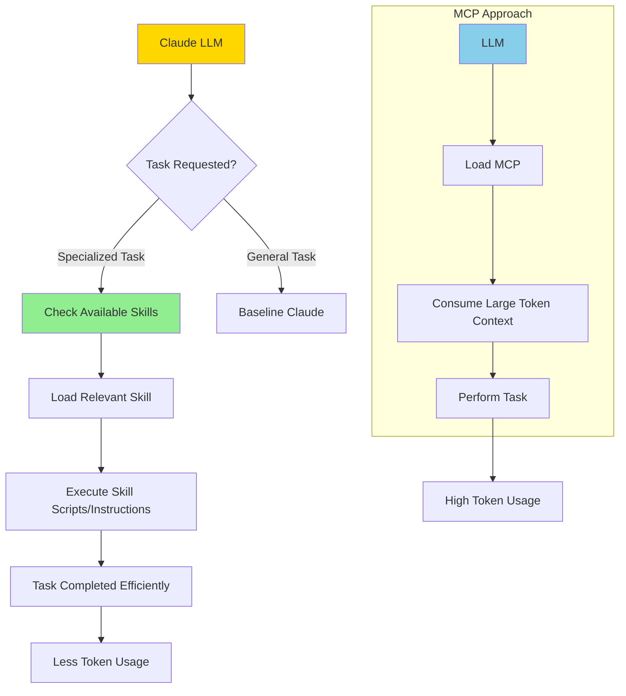

https://simonwillison.net/2025/Oct/16/claude-skills  

Simon Willison’s article introduces **Claude Skills**, a new Anthropic feature that significantly enhances LLM capability by enabling specialized, modular task execution. Skills are **folders** containing a Markdown file with instructions, optional scripts, and resources that the model can load **only when relevant**, making them **token-efficient** and highly flexible.

Key points:

- **What Skills Are:**  
  - Markdown-based instructions with optional YAML frontmatter.  
  - May include scripts or resources to handle specialized tasks (e.g., Excel, PDFs, Slack GIFs).  
  - Loaded only when needed, conserving token usage.

- **How They Work:**  
  - Claude scans available skills on session start, reading short YAML summaries.  
  - Full skill details are used only if a related task arises.  
  - Require a coding environment with filesystem and script execution.

- **Comparison to MCP (Model Context Protocol):**  
  - **MCP** is heavy, token-expensive, and protocol-driven.  
  - **Skills** are lightweight, simple to create, and integrate seamlessly into coding agents.  
  - MCP implementations often limit LLM performance due to context size.  

- **Applications & Potential:**  
  - Can create domain-specific “agents” (e.g., data journalism pipelines).  
  - Easily shareable, simple to adapt, and not model-locked.  
  - Expected to trigger a “Cambrian explosion” of community-made skills, overshadowing MCP adoption.  

- **Security & Safety:**  
  - Depends on sandboxed coding environments to prevent abuse and prompt injection risks.  

### Mermaid Diagram of Claude Skills vs MCP

This illustrates how **Skills offer a lightweight, modular, and token-efficient alternative** to MCP for enhancing LLM capabilities.
