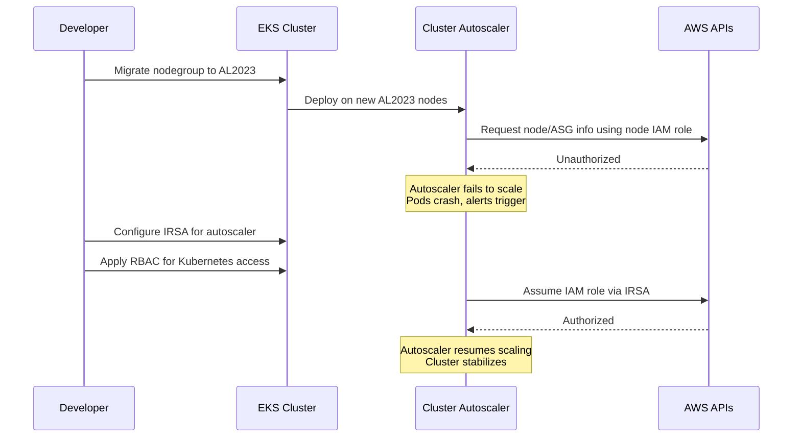

**We Broke Our EKS Cluster Autoscaler During Amazon AL2023 Migration (and Fixed It)— Here’s What We Learned**  
https://medium.com/@dilshanwijesooriya/we-broke-our-eks-cluster-autoscaler-during-amazon-al2023-migration-and-fixed-it-heres-what-we-learned-xxxxxxxx

---

The article details the unexpected failure of an **Amazon EKS Cluster Autoscaler** during a migration from **Amazon Linux 2 (AL2)** to **Amazon Linux 2023 (AL2023)**.  

**Key Points:**

- **Reason for Migration:**  
  - AL2023 offers better performance, enhanced security, and longer support.  
  - Amazon will deprecate AL2 AMIs for EKS after November 26, 2025.  

- **Problem Encountered:**  
  - Cluster Autoscaler broke after switching to AL2023.  
  - Symptoms included:  
    - Datadog agents stopped sending metrics  
    - Service crashes and failing health checks  
    - Autoscaler logs showing `Unauthorized` errors  
  - Root Cause:  
    - AL2023 **disables pod access to EC2 instance metadata by default**.  
    - Any pod relying on the node’s IAM role for AWS API calls (like the autoscaler) loses permissions.

- **Solution Implemented:**  
  1. **Switch to IRSA (IAM Roles for Service Accounts)** for the autoscaler.  
  2. **Add Kubernetes RBAC** for necessary resource access.  
  3. **Disable default service account** in the Helm deployment.  
  4. **Remove IAM permissions** from the nodegroup, relying solely on IRSA + RBAC.  

- **Lessons Learned:**  
  - AL2023 requires stricter access handling; node IAM role shortcuts no longer work.  
  - IRSA + RBAC is essential for production stability.  
  - Test autoscaling and draining behavior in staging before production migration.  
  - Consider **EKS Pod Identity** for future migrations, though IRSA is currently reliable.

---

### Migration and Fix Process (Mermaid Diagram)

**Conclusion:**  
Migrating to AL2023 improves security but breaks legacy IAM patterns. Using **IRSA + RBAC** or **EKS Pod Identity** is mandatory for cluster components like the autoscaler to function correctly.