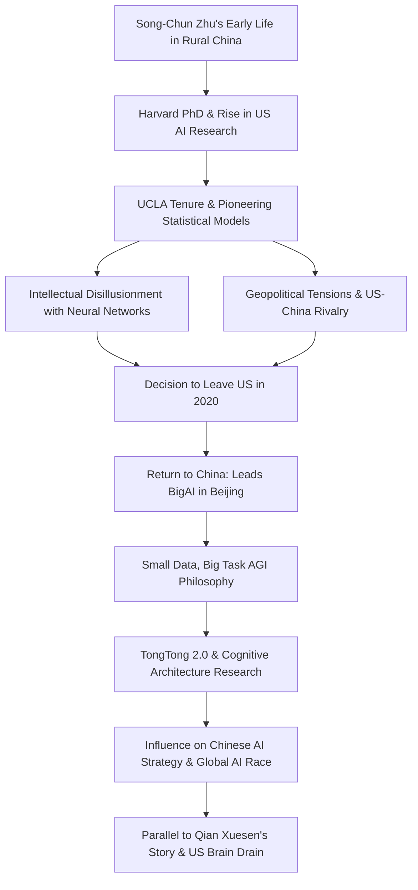

**‘I have to do it’: Why one of the world’s most brilliant AI scientists left the US for China**  
https://www.theguardian.com/world/2025/sep/16/song-chun-zhu-ai-us-china-race  

Song-Chun Zhu’s life and career reflect the intertwining of personal ambition, scientific innovation, and geopolitical tension in the modern AI race. Born in rural China in 1969, Zhu rose from humble beginnings to become one of the world’s leading AI researchers, pioneering statistical pattern recognition methods that laid foundations for current AI systems. After thriving for decades in the United States—earning a Harvard PhD, shaping UCLA’s AI research hub, and securing major Pentagon and NSF grants—he suddenly returned to China in 2020.  

Zhu’s departure was driven by intellectual disillusionment with the dominance of neural networks and “big data, small task” AI approaches in Silicon Valley, as well as increasing hostility toward Chinese-born scientists amid rising US-China tensions. In Beijing, he now leads the lavishly funded Beijing Institute for General Artificial Intelligence (BigAI), advocating a “small data, big task” philosophy focused on cognitive architectures that reason, plan, and exhibit commonsense understanding—capabilities he argues large language models like ChatGPT cannot achieve.  

His work is emblematic of shifting global scientific power, as China aggressively recruits talent and invests in AI to compete with US initiatives, while political pressures and restrictive policies threaten America’s historical openness toward foreign researchers. Zhu’s story mirrors that of Qian Xuesen, the Chinese rocket scientist forced out of the US during the McCarthy era, symbolizing how geopolitical mistrust can drive brain drain.  

BigAI’s projects, such as the virtual child TongTong 2.0, aim to demonstrate AI systems that mimic human-level reasoning and social intuition. Zhu frames his mission as the pursuit of a “unified theory of AI” rather than a nationalist endeavor, yet his work aligns with China’s centralized AI ambitions. His journey highlights the delicate intersection of scientific vision, personal conviction, and global rivalry in the quest for artificial general intelligence.

